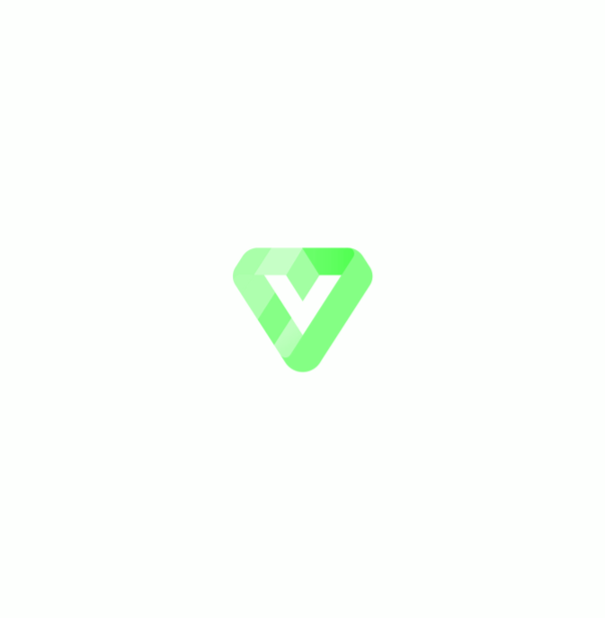

<div align=center >
<a href="# Get Started"></a>
</div>
<h1 align=center >✌️ Valiant - Discord bot ✌️ </h1>

<div align=center >
  <a href="https://github.com/discordjs">
    
  </a>

  <a href="https://github.com/itstylerrr/Valiant/blob/LICENSE.md">
    
  </a>
  
  <a href="#">
  
  
  <a href="https://github.com/itstylerrr/Valiant">
  

  <iframe src="https://discord.com/widget?id=971534964527087726&theme=dark" width="350" height="500" allowtransparency="true" frameborder="0" sandbox="allow-popups allow-popups-to-escape-sandbox allow-same-origin allow-scripts"></iframe>

</div>
    
## 👋 Get Started:
First you should star this repository because you never know, it might not work if you dont. :)

Anyways, to get started, you should clone this repository by running:
```
    git clone https://github.com/itstylerrr/Valiant.git
```
Now, go into the Configs folder and rename `EXAMPLEmain.json` to `main.json` and fill out all of the information.

If there are any errors you should be able to solve them with basic JS and Discord.JS knowledge. I will not be helping out with any of that basic stuff unless I have time or get enough people to ask me about it. To get help with other errors, join the support server that is placed at the top of this README.

Last thing you should do is check all the files and rename every `Valiant` to whatever you want it to be.

Finally, if you want to rename the main file `valiant.js` you need to make sure that you rename all the imports from other files *I will not be helping you out if you decide to do this*.

Anyways if you decide to self host this bot, please make sure you give me plenty of credit :) Or I will come find you and... well i cant really do anything. But please give me credit this has taken alot of time and effort :).

## ✔ To Do:

 - [x] Get Valiant running
 - [x] Create slash commands
 - [x] Add database support to bot
 - [x] Add database models
 - [x] Add music player
 - [x] Add server settings command
 - [x] Add moderation command
 - [x] Welcome & Goodbye system
 - [ ] Add per-guild economy system
 - [ ] Add per-guild XP system
 - [ ] Finish economy
 - [ ] Add a chatbot
 - [ ] Get to 50 total **working** commands.
 - [ ] Get 75 + commands; current: 11
 - [ ] Create website

    
... More to come.

## ©️ Credits

**-Tyler#7922** - Developer. \
**Rahuletto#0243** - Simply DJS & XP (if added) package - ```npm i simply-djs``` & ```npm i simply-xp``` \
**NekoBot.xyz** - NekoBot API - Image manipulation commands \
**Worn Off Keys, Discord.JS, and The Coding Den Servers** - Helping me when I get stuck (which is alot) \
**Any others...** - If you believe I used any of your exact code and you want credit please add me on Discord or join the support server and explain.
